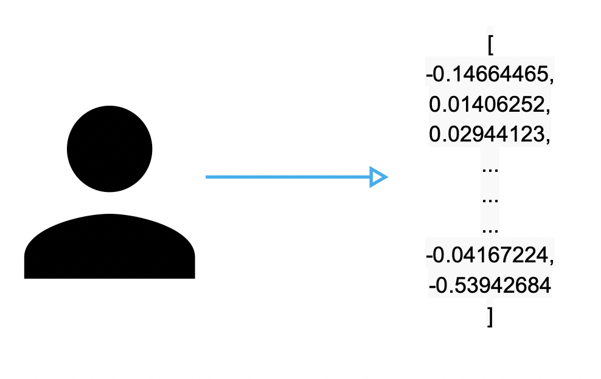

# Elastic Face Recognition
This notebook is based on a blog article on how to build a face recognition system with python and Elasticsearch. The full blog can be seen [here](https://www.elastic.co/blog/how-to-build-a-facial-recognition-system-using-elasticsearch-and-python).

## How does the system work
This facial recognition system works by creating vector representations on people's faces and storing them as dense vectors on Elasticsearch documents to create an index of faces to be later recognized.

The recognition part works by running a face through the same vectorization process and querying the cosine similarity with the vectors stored on the index, thus returning the "most look-alike" document. If the similarity is under certain threshold, we consider the face to be unknown.
